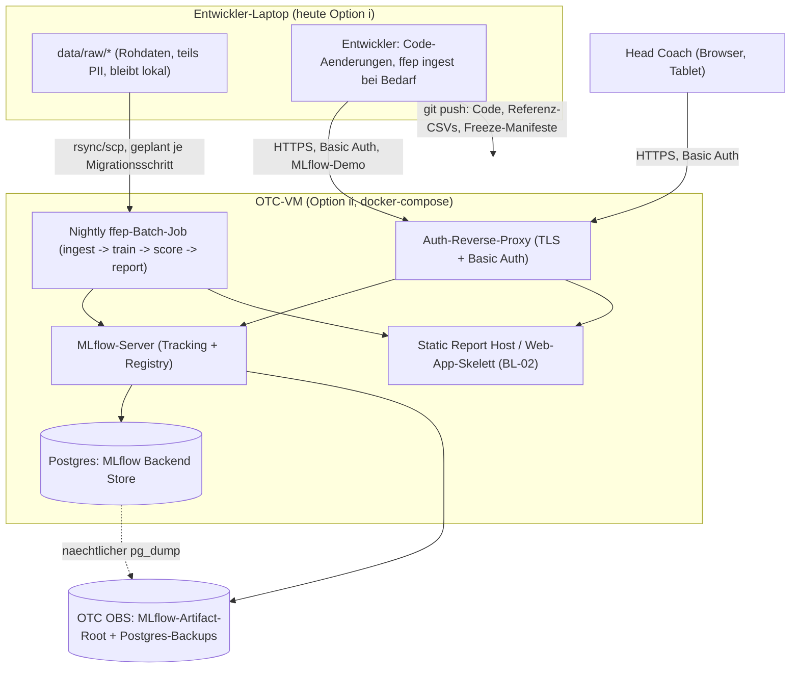
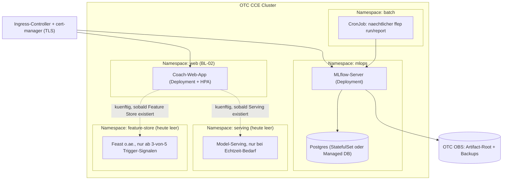

# ADR 0001 — Modell-Plattform für EP/WP: Single Machine, OTC-VM oder Kubernetes?

**Status:** Entschieden, unterschrieben 2026-09-09 (Option ii, gestaffelt)
**Datum:** 2026-09-08 (Entwurf), 2026-09-09 (Entscheidung)
**Betrifft:** `flag_football_ep` EP/WP-Modelle, MLflow-Tracking/Registry, künftige
Coach-Web-App (BL-02)

## Kontext

Dieses Dokument entscheidet die Plattform-Grundlage für die Mehr-Team-Zukunft des Projekts:
U17 bis Seniors, Männer- und Frauen-Nationalmannschaften, und perspektivisch weitere Coaches,
deren heute in Excel geführte Play-by-Play-Analyse in eine Web-App überführt werden soll
(BL-02, vgl. `docs/hc-notes-2026-09-03.md`: "Er hat super viel Arbeit in seine Excel Datei
gesteckt … Dazu wäre es sehr gut eine App zu haben"). Der Kopftrainer selbst hat diese
Entscheidung explizit angestoßen, weil ein falscher Default heute teuer werden könnte, sobald
U17 bis Seniors das Tooling mitnutzen wollen.

**Aktueller Stand (verifiziert, RESEARCH Q6-Q10):** ein Programm (die deutsche Frauen-
Nationalmannschaft), ca. 30.000 Plays im kanonischen Korpus, ausschließlich Batch-Scoring
(Reports laufen in unter 10 Minuten), kein Echtzeit-Bedarf, ein einzelner Entwickler mit
alleinigem Schreibzugriff. Das MLflow-Tracking läuft lokal gegen `sqlite:///mlruns/mlflow.db`
mit einem dateibasierten Artifact-Store — das ist die heutige "Option (i)".

Wichtig für die Reihenfolge dieser Phase: die parallel in dieser Phase laufenden
Hygiene-Arbeiten (Lineage-Erfassung, Korpus-Freeze, Beförderungs-Gate, CI-Lauf auf
Fixture-Daten — Pläne M3-05-02/03/06) sind **Option-(i)-nativ und von dieser Entscheidung
unabhängig**: sie funktionieren unverändert, unabhängig davon, welche Plattform-Option hier
gewählt wird, und ein späterer Umzug auf Option (ii) oder (iii) übernimmt sie unverändert.
Diese ADR entscheidet also **wann**, nicht **ob**, sich die Grundlage ändert.

## Optionen

Die folgende Tabelle stammt unverändert aus RESEARCH Q6 (Kosten sind, wo mit
`[ASSUMED, Größenordnung]` markiert, Schätzungen aus Websuche, nicht Angebote eines
Preisrechners — die Open Telekom Cloud veröffentlicht für die relevanten SKUs (ECS/CCE/OBS)
ausdrücklich keine Festpreise, sondern verweist auf einen Preisrechner, den jede:r selbst
bedienen muss, siehe Quellen unten).

| Option | Monatliche Kosten (Größenordnung) | Operativer Aufwand (Solo-Entwickler) | Migrationspfad ab heute | Bricht zuerst bei 10x Daten / 10 Teams |
|---|---|---|---|---|
| **(i) Single Machine** — MLflow file/SQLite + DVC + geplanter Batch (**heutiger Zustand**) | 0 EUR zusätzlich | Minimal — läuft bereits | Kein Migrationsaufwand; das IST heute | SQLites Single-Writer-Modell riskiert Lock-Contention bei gleichzeitigem Mehrbenutzer-Training/-Promotion; die Registry lebt nur auf einem Laptop — keine Verfügbarkeit ohne dessen Betrieb, was eine Coach-Web-App mit eigenständiger Uptime blockiert |
| **(ii) Containerisiert auf OTC** — eine VM (docker-compose: MLflow-Server + Postgres + OBS-Artifact-Root + Scoring-Job + kleine Web-App) | Niedrige zweistellige Euro-Beträge/Monat, Größenordnung, für eine kleine ECS-VM + OBS-Storage (Cent/GB) `[ASSUMED — niedrige Konfidenz, OTC hat keinen Festpreis, nur einen Rechner]` | Moderat — eine VM patchen/absichern, Postgres-Backups, MLflow-Auth muss explizit aktiviert + Default-Admin-Passwort rotiert werden (nicht standardmäßig an), eine docker-compose-Datei pflegen; noch im Rahmen eines Solo-Entwicklers nach Ersteinrichtung | `mlflow server --backend-store-uri postgresql://... --default-artifact-root s3://...` ersetzt die `sqlite:///`-URI; `MLFLOW_S3_ENDPOINT_URL` gegen OTC OBS ist im eigenen Repo bereits erprobt (`docs/hackathon-otc-upload.md`) | Handhabt Batch-Scoring für eine Handvoll Programme komfortabel; bleibt eine Single-VM-Kapazitätsgrenze bei vielen gleichzeitigen Trainingsläufen, aber Postgres beseitigt SQLites Schreib-Concurrency-Grenze |
| **(iii) Kubernetes** (OTC CCE) + MLflow + Feature Store + Model Serving | CCE-Control-Plane kostenlos für ≤50 Non-HA-Nodes, aber die zugrundeliegenden ECS-Worker-Nodes kosten pro Node dasselbe wie bei (ii)'s VM, und ein Spielzeug-Cluster braucht mindestens 2-3 Nodes — plausibel das 2-3fache von (ii)'s Untergrenze `[ASSUMED — niedrige Konfidenz]` [ZITIERT: t-cloud-public.com/en/prices/pricing-models/computing-container, abgerufen 2026-09-08, "free for up to 50 nodes (not HA)"] | Hoch — Cluster-Upgrades, Netzwerk-Policies, K8s-Secrets, YAML/Helm-Manifeste, Ingress/TLS: eine kategorisch größere operative Fläche als (ii) für eine einzelne Person | (ii) ist strikte Voraussetzung — erst containerisieren, dann K8s-Manifeste/Helm-Charts um dieselben Images bauen | An der tatsächlichen Skala dieses Projekts bricht nichts auf eine Art, die spezifisch K8s löst; K8s rechtfertigt seine Komplexität erst bei Echtzeit-High-QPS-Serving oder vielen unabhängig skalierten Diensten — beides existiert hier nicht (Kontext: "kein Echtzeit-Bedarf heute") |

**Kostenhinweis:** Jede mit `[ASSUMED]` markierte Zahl ist eine Größenordnung, keine Zusage.
Wer vor der Unterschrift eine belastbare Zahl braucht, sollte den echten OTC-Preisrechner
selbst bedienen (siehe Entscheidungs-Checkpoint unten) — diese ADR tut das nicht für Sie.

## Feature Store (RESEARCH Q7)

Ein Feature Store löst zwei Probleme: Training-Serving-Skew (Features werden zur Trainings-
und zur Score-Zeit unterschiedlich berechnet) und Feature-Wiederverwendung über Teams/Modelle
hinweg. Der EP/WP-Feature-Satz dieses Projekts (~12 Batch-only Play-State-Spalten,
`hyperparams.EP_FEATURES`/`WP_FEATURES`) wird von **demselben** `prepare_fn`/`mutate_fn`-Paar
sowohl zur Trainingszeit (`model/train.py`) als auch zur Score-Zeit (`model/score.py` — beide
importieren aus `features/mutations.py`) berechnet — Training-Serving-Skew ist hier also
bereits strukturell durch geteilten Code verhindert, nicht durch fehlende Infrastruktur. Es
gibt keinen Echtzeit-Serving-Bedarf. Ein leichtgewichtiges Äquivalent existiert de facto
bereits: `plays.parquet`/`plays_scored.parquet` plus `training_data_sha256` (bestehend) und der
in dieser Phase eingeführte `corpus_fingerprint` (M3-05-03) sind bereits "ein versioniertes
Feature-Parquet mit Schema-Vertrag und Fingerabdruck" — nur nicht so benannt.

Nach dem Tacnode-Entscheidungsrahmen (3 von 5 Auslöse-Signalen: mehrere Modelle mit
inkonsistenten Feature-Definitionen, Training-Serving-Mismatch-Vorfälle, Echtzeit-
Aktualitätsbedarf, Feature-Engineering-Flaschenhals, doppelte teamübergreifende
Feature-Arbeit) [ZITIERT: tacnode.io/post/do-you-need-a-feature-store, abgerufen 2026-09-08]
steht dieses Projekt heute bei **0 von 5**.

**Empfehlung:** Kein Feature Store jetzt. Neu bewerten (Feast, die Standard-Open-Source-Wahl),
sobald ein zweites/drittes Programm ein Modell mit materiell abweichenden, von einer anderen
Person als dem aktuellen Entwickler gepflegten Features braucht, oder wenn jemals Echtzeit-
Scoring hinzukommt (z. B. eine Live-Win-Probability-Einblendung während einer Übertragung, was
zusätzlich das Backlog-Item "Gameclock aus Broadcast" voraussetzen würde).

## Multi-Tenant-Datenmodell (RESEARCH Q8)

Das kanonische Plays-Schema trägt bereits die Ansätze einer Programm-Skalierung:
`source`, `competition_tier` (One-Hot, seit Phase 1.3 in den Produktions-Features) und
`team_mapping.csv` (bereits um `-M`-Suffixe erweitert, um Männer- von Frauen-
Nationalmannschaften zu unterscheiden, die sich den kanonischen Code `GER` teilen — siehe
`ffep.toml`s `[sources.ifaf]`-Kommentar). Eine erstklassige `programme_id`/`season`-Scope-Spalte
würde dieses Muster erweitern, nicht ersetzen.

**Geteiltes Modell vs. Modell pro Programm:** Die Evidenz, die diese Phase selbst produziert
hat, spricht für ein geteiltes Modell mit Kovariate statt Modelle pro Programm — der erste
echte Tier-Vergleich (`per_tier_metrics_ep.csv`, `docs/epa-refinement-2026-10.md`s Nachtrag)
fand `womens-international` (IFAF) bei EP-Log-Loss 0.881 gegenüber `mixed-other` bei 0.946 —
ein realer, messbarer Tier-Effekt, der bereits durch das Pooling von Daten über den Korpus
hinweg mit einer Tier-Kovariate erfasst wird. Ein Modell, das nur auf IFAF-Daten trainiert
würde, hätte weniger Daten und würde genau diesen Pooling-Vorteil verlieren. Da das Volumen
jedes einzelnen Programms klein ist (allein die Frauen-Nationalmannschaft hat ca. 20.000 Plays;
ein neues U17-Programm würde nahe null starten), ist ein geteiltes Modell mit
Programm-/Tier-Kovariate die evidenzbasierte Empfehlung — kein Modell pro Team.

**PII-Grenzen:** `player_mapping.csv` existiert bereits als programmgebundene
Kader-Zuordnungsdatei mit einem durchgesetzten PII-Gate-Muster (die kaderbasierten Prüfungen in
`tests/test_m3_epa_docs.py`). Das Kader eines zweiten Programms braucht seine eigene
skopierte Zuordnungsdatei nach demselben Gate-Prinzip — niemals mit dem Kader eines anderen
Programms ohne ausdrückliche Zustimmung zusammengeführt.

**Auth für eine Coach-Web-App:** außerhalb des Umfangs dieser Phase (BL-02), aber die
Plattform-Wahl bestimmt, wo sie leben würde — ein dateibasierter Single-Machine-Ansatz
(Option i) hat kein natürliches Zuhause für programmgebundenen Login/Session-Zustand; eine
Postgres-gestützte Bereitstellung (Option ii) ist dort, wo Benutzer-/Session-Tabellen leben
würden, sollte BL-02 gebaut werden.

## MLflow-Betriebsrealitäten (RESEARCH Q9)

MLflow hat standardmäßig keine Authentifizierung. Mehrere CVEs wurden 2026 gegen
unauthentifizierte MLflow-Tracking-Server veröffentlicht (SSRF über Webhook-Zustellung,
CVE-2026-64849; Auth-Bypass an Job-Endpunkten, CVE-2026-0545; Default-Credential-Bypass,
CVE-2026-2635) [ZITIERT, siehe Quellen — Tertiär, nicht in voller Advisory-Tiefe gelesen].
Basic-HTTP-Auth ist verfügbar (`pip install 'mlflow[auth]'`, `mlflow server --app-name
basic-auth`), liefert aber standardmäßig das Credential `admin`/`password1234` aus, das sofort
rotiert werden muss [ZITIERT: mlflow.org/docs/latest/self-hosting/security/basic-http-auth/,
abgerufen 2026-09-08]. Dies ist relevant, sobald jemals Option (ii) oder (iii) tatsächlich
umgesetzt wird — für den heutigen lokalen Betrieb (Option i, `mlflow ui` auf Loopback) besteht
diese Angriffsfläche nicht.

SQLite ist für den heutigen Single-Writer-Betrieb ausreichend; eine echte RDBMS wird zur
Standardempfehlung, sobald gleichzeitige Mehrbenutzer-Schreibzugriffe stattfinden (Option
ii/iii) `[ASSUMED — allgemeine MLflow-Betriebsempfehlung, diese Session nicht gegen eine
spezifische MLflow-Doku-URL verifiziert]`.

**MLflow bleibt** die Wahl der Tracking-/Registry-Lösung unabhängig von dieser Entscheidung —
es ist bereits tief in `train.py`/`registry.py`/`score.py`/`experiments.py` verankert, und
keine Alternative (Weights & Biases: SaaS-Abhängigkeit, die dieses Projekt bewusst vermeidet;
ZenML/Metaflow: volle Pipeline-Orchestrierung, die dieses Projekts dreistufiger `ffep run`
nicht braucht) adressiert die tatsächlichen Schmerzpunkte (manuelle Promotion, fehlende
Lineage, kein Gate — alle innerhalb MLflows behebbar, siehe Phase M3-05 Teil A) besser.

## Empfehlung

RESEARCHs gestufte Empfehlung (Q10), hier unverändert übernommen:

**Bei Option (i) bleiben** durch diese Phase und BL-02s ersten Entwurf hindurch. Zu
**Option (ii)** migrieren, sobald ein konkreter Auslöser eintritt — ein zweiter Mensch braucht
Schreibzugriff auf die Registry, oder BL-02 muss unabhängig davon laufen, ob der Laptop des
Entwicklers eingeschaltet ist. **Kubernetes und einen Feature Store gemeinsam** zurückstellen,
nicht unabhängig voneinander — sie werden tendenziell an demselben Skalenpunkt relevant
(Echtzeit-Anforderung oder mehr als ca. 3 Programme mit materiell abweichenden Feature-
Bedürfnissen), also gemeinsam statt getrennt bewerten.

## Entscheidung

Entscheidung getroffen und unterschrieben am 2026-09-09 (Projektinhaber, nach Lektüre der
Optionen, der Empfehlung und des Anhangs A):

**Option (ii), gestaffelt.**

1. **Sofort, lokal:** Containerisierung der Modellplattform mit `docker-compose` — MLflow-Server
   mit Postgres als Backend und einem S3-kompatiblen Artefaktspeicher (lokal MinIO, später OBS mit
   denselben Einstellungen). Die `ffep`-Pipeline spricht mit dem Store nur noch über
   Tracking-/Artefakt-URLs. Ziel: kein „works on my machine“ mehr, ohne Cloud-Kosten.
2. **Umzug auf eine OTC-VM** (Zielbild A.2) spätestens beim Migrationsauslöser — ein zweiter
   schreibender Nutzer oder eine Web-App (BL-02), die unabhängig vom Laptop des Inhabers laufen
   muss —, gern früher, wenn die VM ohnehin gewünscht ist. Der Umzug ist dann Compose-Datei plus
   Secrets, Backups und Reverse Proxy.
3. **Kubernetes und Feature Store zurückgestellt** (Zielbild A.3 bleibt als Referenz); erneut zu
   prüfen, wenn mehrere Programme (U17 bis Seniors, Männer/Frauen) eigene Pipelines und
   Deployments brauchen.
4. **Multi-Tenant-Scoping jetzt anlegen:** gemeinsames EP/WP-Modell mit Tier-Kovariate statt
   Modell je Programm; Programm/Team/Saison als Scoping im kanonischen Korpus; PII-Grenzen je
   Programm über die Roster-Zuordnung.

Umsetzung: Punkt 1 als eigener Plan der Phase M3-5 (`M3-05-09-PLAN.md`); Punkt 2 als Backlog-Eintrag
mit dem Auslöser als Bedingung; Punkt 4 fließt in die Planung von BL-02 ein.

## Quellen

- RESEARCH `M3-05-RESEARCH.md`, Fragen Q6-Q10 (Plattform-Optionen, Feature Store,
  Multi-Tenant-Datenmodell, MLflow-Betriebsrealitäten, Empfehlung) — die vollständige
  evidenzielle Grundlage dieses Dokuments.
- [MLflow Authentication with Username and Password](https://mlflow.org/docs/latest/self-hosting/security/basic-http-auth/) — abgerufen 2026-09-08
- [MLflow Artifact Stores](https://mlflow.org/docs/latest/ml/tracking/artifact-stores/) — abgerufen 2026-09-08
- [Do You Need a Feature Store? Decision Framework for ML Teams](https://tacnode.io/post/do-you-need-a-feature-store) — abgerufen 2026-09-08
- [Open Telekom Cloud / T Cloud Public — Pricing Models: Computing & Containers](https://www.t-cloud-public.com/en/prices/pricing-models/computing-container) — abgerufen 2026-09-08
- [MLflow SSRF advisory (GHSA-7gwp-5pfp-969j)](https://github.com/advisories/GHSA-7gwp-5pfp-969j) — abgerufen 2026-09-08
- [CVE-2026-0545 summary](https://www.sentinelone.com/vulnerability-database/cve-2026-0545/) — abgerufen 2026-09-08
- `docs/hackathon-otc-upload.md`, `docs/hc-notes-2026-09-03.md`, `docs/model-training.md`,
  `ffep.toml` — projektinterne Referenzen, gelesen 2026-09-08

## Anhang A: Ist-Zustand und Zielbilder

*Nachtrag, angefordert vor der Unterschrift: "die Kubernetes-Frage einmal aufmachen — wo stehen
wir heute und wie könnte das Ganze aussehen."* Dieser Anhang ist rein additiv — er ändert nichts
an den Optionen, der Empfehlung oder der (weiterhin leeren) Entscheidungszeile oben; er liefert
die konkreten Bilder, die die Entscheidung braucht.

### A.1 Ist-Zustand heute

**Wo Daten, Modelle, MLflow-Store, DVC-Remote, Reports und die CV-Pipeline heute liegen:**

Alles läuft auf einem einzigen Entwickler-Laptop (M5 Max) — es gibt keinen Server-Prozess, der
unabhängig vom Ein-/Ausschaltzustand dieses Laptops erreichbar wäre.

| Komponente | Ort | Versioniert/gesichert wie | Quelle |
|---|---|---|---|
| Rohdaten (`data/raw/hudl`, `hc_files`, `ifaf`) | lokal, `data/raw/*` | **nicht** in git — PII (Spielernamen, Statistiker-IDs); `data/raw/legacy`/`sportapp` sind getrackt (keine PII) | `.gitignore` (`data/raw/hudl/*`, `data/raw/hc_files/`, `data/raw/ifaf/`, alle mit PII-Begründung im Kommentar), `docs/pipeline.md` Abschnitt 2 |
| Kanonisches Parquet (`plays.parquet`, `games.parquet`) | lokal, `data/processed/` | **nicht** in git — regenerierbar, atomar pro `ffep ingest` neu geschrieben | `.gitignore` (`data/processed/*`), `docs/pipeline.md` Abschnitt 2 |
| Referenz-CSVs (`team_mapping.csv`, `player_mapping.csv`, `group_opponents.csv`, `corpus_freeze/*.json`, …) | lokal, `data/reference/`, in git | git (einzige Quelle der Wahrheit für diese Dateien) | `.gitignore`-Kommentar ("data/reference/ … intentionally NOT ignored"), `docs/coaching-reports.md` Abschnitt "Die zwei maintained reference files", `ffep.toml` `[reference]` |
| MLflow-Tracking-Store | lokal, `sqlite:///mlruns/mlflow.db` | **nicht** in git (`mlruns/` gitignored); kein separat verifiziertes Backup-Regime — RESEARCH Q9 flaggt das offen | `src/flag_football_ep/model/mlflow_store.py:24-31`, `.gitignore` (`mlruns/`) |
| MLflow-Artifact-Root | lokal, `file://`-Pfad unter `mlruns/` | wie oben, dateibasiert, ein Laptop | `model/mlflow_store.py:33-38` |
| Modell-Registry (Versionen, `champion`-Alias) | innerhalb desselben SQLite-Stores | MLflows eigene Versionierung (nie überschrieben), aber physisch nur auf diesem einen Laptop vorhanden | `model/registry.py`, `docs/model-training.md` Abschnitt 7 |
| DVC-Remote (CV-Datensatz-Versionierung) | konfiguriert gegen OTC OBS, **Bucket-Name noch `ffep-datasets-PLACEHOLDER`**, Zugangsdaten in dieser Umgebung noch nicht vorhanden | `.dvc/config`, `ffep.toml` `[cv]` (`dvc_remote_*`) | `docs/hackathon-otc-upload.md` ("Zugangsdaten … liegen in dieser Umgebung noch nicht vor — voraussichtlich für einen längeren Zeitraum nicht") |
| Reports (5 HTML-Produkte) | lokal, `reports/<datum>/` + `reports/latest/` | **nicht** in git — PII (Spielernamen im Own-Team-Report) | `.gitignore` (`/reports/`), `docs/coaching-reports.md` Abschnitt "Output layout" |
| CV-Pipeline (Detektor-Training, CVAT) | lokal; CVAT self-hosted auf `http://localhost:8080` (Loopback, nie routable — die Aufnahmen sind PII); Detektor-Training auf einer separaten Dell-Workstation mit 8-GB-CUDA-GPU (Nutzerkontext, nicht Teil des Repos); `ffep.toml`s `[cv]`-Default `device = "cpu"` gilt für Umgebungen ohne diese GPU | `ffep.toml` `[cv]` (Kommentar zu `cvat_host`: "muss nie eine routable Schnittstelle binden, weil die Aufnahmen PII sind") |

**Was wann läuft:** `ffep ingest` → `ffep train --model both` → `ffep score` → `ffep report`
(einzeln oder gebündelt über `ffep run`, das Fetch standardmäßig auslässt), jeweils manuell vom
Entwickler angestoßen — kein Scheduler, kein Cronjob, kein CI-Trigger für den produktiven Lauf.
Ein realer `ffep run` (phase 01.2-17-Baseline, 257 Spiele/21.437 Plays) brauchte insgesamt
**1,79 Sekunden** (ingest 0,39 s, train_ep 1,04 s, train_wp 0,26 s, score 0,10 s) — die
Report-Generierung selbst ist der langsamere, separate Schritt und wird gegen ein 10-Minuten-
Budget gemessen (REQ-S1-16), aber auch das bewegt sich laut Kontext im niedrigen Minutenbereich,
weit unter dem, was einen dedizierten Scheduler rechtfertigen würde. `mlflow ui` läuft nur, wenn
der Entwickler es lokal startet, gegen dieselbe SQLite-Datei.

**Wer worauf Zugriff hat:** ein einzelner Entwickler mit alleinigem Schreibzugriff auf die
Registry (Kontext-Abschnitt oben, RESEARCH Q6-Q10 verifiziert). Der Head Coach bekommt keinen
eigenen Zugriff auf irgendeinen Teil der Pipeline — er erhält die fertigen HTML-Reports (und
umgekehrt liefert er seine eigenen, hand-gepflegten Excel-Workbooks, z. B. `Germany Analytics
Stats EC 2025 vs WC Nations.xlsx`, die dann unter `data/raw/hc_files/` — PII, gitignored —
abgelegt werden) **jeweils von Hand**, nicht über einen gemeinsam erreichbaren Dienst
(`docs/hc-notes-2026-09-03.md`, `docs/coaching-reports.md` Abschnitt "Output layout": "reports/
ist git-ignoriert … handle copies to shared storage or the tablet accordingly"). `mlflow ui` ist
laut `docs/mlflow-ui-howto.md` explizit **kein** Link, den der Coach selbst navigiert, sondern
ein Demo-Werkzeug, das der Entwickler live vorführt — die coach-lesbare Dauerlösung ist die
generierte Modellkarte (`docs/epa-modellkarte.md`, `scripts/render_model_card.py`).

**Was wo versioniert ist:**
- **git** — Code, Dokumentation, Referenz-CSVs (inkl. der seit `M3-05-03` (Commit `1085c91`)
  committeten, fingerprinted Corpus-Freeze-Manifeste unter `data/reference/corpus_freeze/`),
  `.dvc`-Zeigedateien (nie die referenzierten Binärdaten selbst).
- **DVC** — die großen CV-Datensätze (Labels, Eval-Set, Hackathon-Bundles), Remote ist OTC OBS,
  aber der Bucket ist noch der Platzhalter — dieser Pfad ist heute vorbereitet, nicht live.
- **MLflow** — Modell-Läufe, -Versionen, -Metriken, -Artefakte und der `champion`-Alias, alles
  innerhalb der einen lokalen SQLite-/Datei-Kombination, die selbst nicht in git liegt und (nach
  aktuellem Kenntnisstand, RESEARCH Q9) über kein separat verifiziertes Backup-Regime verfügt.

**PII-Grenzen:** durchgesetzt über `.gitignore` (Rohexporte mit Spielernamen: `data/raw/hudl/*`,
`data/raw/hc_files/`, `data/raw/ifaf/`; Videos/Labels/Bundles: `data/video/*`, `data/labels/*`,
`data/bundles/*`, `data/private/*`; Reports: `/reports/`) und über die Roster-Zuordnungsdatei
`data/reference/player_mapping.csv` (selbst keine Rohdaten, aber eine Crosswalk-Tabelle, die pro
Programm gepflegt wird — die im ADR-Haupttext unter "Multi-Tenant-Datenmodell" beschriebene
PII-Gate-Disziplin). Der CVAT-Host bindet bewusst nur Loopback, weil die von ihm servierten
Aufnahmen PII sind.

### A.2 Zielbild Option (ii): eine OTC-VM mit docker-compose

**Datenflüsse:** Rohdaten (weiterhin PII-behaftet) bleiben auf dem Laptop und werden gezielt
(rsync/scp, nicht automatisch synchronisiert) auf die VM übertragen, wenn ein Batch-Lauf ansteht
— das ist die einzige Stelle, an der sich das PII-Handling gegenüber heute ändert und die vor
der Migration explizit entschieden werden muss (auf die VM kopieren vs. Ingest weiterhin lokal
laufen lassen und nur `plays.parquet` übertragen). Der nächtliche Batch-Job führt
`ffep ingest → train → score → report` aus, MLflow schreibt Metadaten nach Postgres und
Artefakte nach OTC OBS, Postgres wird nächtlich per `pg_dump` in denselben (oder einen separaten)
OBS-Bucket gesichert. Der Reverse-Proxy ist die einzige extern erreichbare Fläche — sowohl für
den Coach (Report-Host) als auch für den Entwickler (MLflow-UI-Demo, jetzt auch ohne Laptop
erreichbar).

**Was sich für den Entwickler ändert:** Training/Review laufen weiterhin lokal oder gegen die
VM (MLflow-Client kann gegen eine entfernte Tracking-URI sprechen, unverändert `mlflow.set_
tracking_uri(...)`); neu ist die Pflege einer VM (Patches, Secrets, Backup-Verifikation) und
die einmalige Migration der bestehenden Registry-Historie von SQLite nach Postgres (siehe
Migrationsschritte).

**Was sich für den Coach ändert:** Der Report-Host ist über eine feste URL erreichbar,
unabhängig davon, ob der Entwickler-Laptop läuft — das ist der konkrete Auslöser, den die
RESEARCH und der ADR-Haupttext als Migrationstrigger nennen (BL-02 muss "unabhängig vom Laptop"
laufen können). Die Zustellung der xlsx-Workbooks vom Coach an den Entwickler bleibt vorerst
Handarbeit (kein eigener Upload-Pfad in diesem Zielbild vorgesehen).

**Monatliche Kosten nach OTC-Dienst (Größenordnung):**

| Dienst | Zweck | Kosten/Monat (Größenordnung) | Quelle |
|---|---|---|---|
| ECS-VM (klein, z. B. 2 vCPU/4 GB) | Docker-Host für MLflow + Postgres + Batch + Report-Host | niedrige zweistellige Euro-Beträge `[ASSUMED — kein Festpreis, nur ein Rechner]` | [T Cloud Public — Pricing: Computing & Containers](https://www.t-cloud-public.com/en/prices/pricing-models/computing-container), abgerufen 2026-09-08 |
| OBS-Storage (Artefakte + Backups, geringes Volumen — Modell-Pickles, PNGs, `pg_dump`) | Artifact-Root + Backup-Ziel | Cent-Beträge/GB, insgesamt niedriger einstelliger Euro-Betrag/Monat `[ASSUMED]` | dieselbe Quelle; [MLflow Artifact Stores](https://mlflow.org/docs/latest/ml/tracking/artifact-stores/), abgerufen 2026-09-08 |
| Elastic IP / Bandbreite | Externe Erreichbarkeit des Reverse-Proxys | niedriger einstelliger Euro-Betrag/Monat `[ASSUMED]` | dieselbe Quelle |
| **Summe** | | **niedrige zweistellige Euro-Beträge/Monat, Größenordnung** `[ASSUMED — niedrige Konfidenz]` | deckt sich mit der Kostenzeile in der Options-Tabelle oben |

Wer vor der Unterschrift eine belastbare Zahl braucht: den echten OTC-Preisrechner selbst
bedienen — diese Tabelle tut das nicht für Sie (gleicher Hinweis wie im Haupttext).

**Operativer Checklist:**
- **Updates:** monatliches OS-Patching (`unattended-upgrades` oder manuell); Docker-Image-Pins
  in `docker-compose.yml` quartalsweise geprüft und bewusst gebumpt, nie automatisch.
- **Backups:** nächtlicher `pg_dump` des Postgres-Backend-Stores nach OTC OBS (eigener
  Bucket/Prefix, getrennt vom CV-Datensatz-Bucket); wöchentliche Stichprobe nach demselben
  Muster wie `docs/hackathon-otc-upload.md`s Verifikationsschritte (Objekt-Liste + Größen-/
  Hash-Abgleich), nicht nur "Backup lief durch, ohne Fehler".
- **Secrets:** `OTC_OBS_ACCESS_KEY_ID`/`OTC_OBS_SECRET_ACCESS_KEY` (dieselbe Env-Var-Konvention
  wie `docs/hackathon-otc-upload.md`), MLflow-Basic-Auth — das Default-Credential
  `admin`/`password1234` muss sofort nach Aktivierung rotiert werden (RESEARCH Q9,
  [MLflow Basic-HTTP-Auth-Doku](https://mlflow.org/docs/latest/self-hosting/security/basic-http-auth/),
  abgerufen 2026-09-08), TLS-Zertifikat des Reverse-Proxys (automatische Erneuerung, z. B.
  Let's-Encrypt-fähiger Proxy).
- **Monitoring:** kein dediziertes Stack nötig bei dieser Last — ein einfacher Healthcheck
  (Docker-Healthcheck + ein externer Uptime-Ping auf Report-Host und MLflow-`/health`-Endpunkt)
  reicht für einen Solo-Betrieb; Alarmierung per E-Mail/Push genügt.

**Konkrete Migrationsschritte ab heute (nummeriert, Aufwand in Tagen):**
1. OTC-ECS-VM provisionieren + neuen OBS-Bucket für MLflow-Artefakte anlegen (getrennt vom
   CV-Datensatz-Bucket `ffep-datasets-PLACEHOLDER`) — **0,5 Tage**
2. Docker/docker-compose auf der VM installieren, `docker-compose.yml` schreiben (MLflow-Server,
   Postgres, Reverse-Proxy) — **1 Tag**
3. `mlflow server --backend-store-uri postgresql://... --default-artifact-root s3://...` gegen
   OTC OBS zeigen (das `MLFLOW_S3_ENDPOINT_URL`-Muster ist bereits in
   `docs/hackathon-otc-upload.md` erprobt); bestehende Registry-Historie (Versionen, Aliase) von
   der lokalen SQLite-/Datei-Kombination in den neuen Store migrieren — **1-2 Tage, mittleres
   Risiko**, da MLflow keine offiziell unterstützte SQLite-zu-Postgres-Migrationsfunktion
   mitbringt
4. MLflow-Basic-Auth aktivieren, Default-Admin-Passwort sofort rotieren, Reverse-Proxy mit TLS
   davorsetzen — **0,5 Tage**
5. Nächtlichen `ffep run`/`ffep report`-Batch-Job auf der VM einrichten (Cron-Container),
   inklusive Entscheidung, ob Rohdaten-Ingest auf der VM oder weiterhin lokal läuft — **1 Tag**
6. Statischen Report-Host aufsetzen (`reports/latest/` hinter Basic Auth servieren) als erster
   Schnitt des BL-02-Web-App-Skeletts — **1 Tag**
7. Runbooks aktualisieren (`docs/model-training.md`, `docs/mlflow-ui-howto.md`, ein neues
   Betriebs-Runbook im Stil von `docs/hackathon-otc-upload.md`) — **0,5 Tage**
8. Verifikationslauf: ein vollständiger Batch-Zyklus, beobachtet, plus Coach-seitige
   Abnahme des Report-Hosts — **0,5 Tage**

**Gesamtaufwand: ~6-7 Tage**, passend zur "moderat"-Einstufung des operativen Aufwands in der
Options-Tabelle oben.

### A.3 Zielbild Option (iii): Kubernetes (OTC CCE)

**Was (iii) zusätzlich zu (ii) bringt:** Scheduling über eine echte Job-Queue (`CronJob`/`Job`
statt einem Cron-Container), Isolation pro Programm (ein `Namespace` je Programm mit eigenen
Ressourcen-Quotas und `NetworkPolicy`-Regeln, statt allem in einem docker-compose-Stack),
Rolling Updates (ein `Deployment`-Rollout ersetzt Container ohne Downtime, statt
`docker-compose pull && docker-compose up -d` mit einer kurzen Lücke) und Autoscaling
(`HorizontalPodAutoscaler` für einen künftigen Serving-Workload — heute nicht genutzt, da kein
Echtzeit-Bedarf existiert).

**Was es kostet — Geld:** Das CCE-Control-Plane ist kostenlos für Non-HA-Cluster bis 50 Nodes,
aber die zugrundeliegenden ECS-Worker-Nodes kosten pro Node dasselbe wie (ii)s VM, und ein
lauffähiger Cluster braucht mindestens 2-3 Nodes — plausibel das 2-3fache von (ii)s
Kosten-Untergrenze `[ASSUMED — niedrige Konfidenz]` [ZITIERT:
[T Cloud Public — Pricing: Computing & Containers](https://www.t-cloud-public.com/en/prices/pricing-models/computing-container),
abgerufen 2026-09-08, "free for up to 50 nodes (not HA)"].

**Was es kostet — Betriebs-Know-how:** kategorisch mehr als (ii): Cluster-Upgrades,
`NetworkPolicy`-Design, Kubernetes-Secrets-Management, YAML-/Helm-Manifeste, Ingress-/
TLS-/`cert-manager`-Betrieb, RBAC-Rollen pro Namespace — für eine einzelne Person ein
deutlich größerer Lernaufwand als eine `docker-compose.yml`.

**Die ehrliche Liste — welche Probleme (iii) löst, die dieses Projekt heute nicht hat, versus
welche es mit U17-Seniors, mehreren Programmen und weiteren Coaches bekäme:**

| Problem, das (iii) löst | Existiert das heute? | Existiert das bei U17-Seniors + mehreren Programmen + weiteren Coaches? |
|---|---|---|
| Mandantentrennung (Multi-Tenancy) zwischen Programmen — getrennte Secrets, Ressourcen-Quotas, PII-Grenzen pro Programm | Nein — ein Programm, eine PII-Grenze (`player_mapping.csv`) | Ja, plausibel — jedes Programm braucht seine eigene Roster-Zuordnung ohne Vermischung (bereits im Multi-Tenant-Datenmodell-Abschnitt oben so beschrieben), ein Namespace pro Programm wäre die natürliche Grenze |
| RBAC (rollenbasierte Zugriffskontrolle) für mehrere Menschen mit unterschiedlichen Rechten | Nein — ein Entwickler, alleiniger Schreibzugriff | Ja, sobald ein zweiter Mensch Schreibzugriff auf die Registry braucht (der bereits im Haupttext genannte Migrationstrigger zu (ii) — bei (iii) käme die feingranulare Rechtevergabe pro Programm/Rolle hinzu) |
| Unabhängig geplante Pipelines pro Programm (unterschiedliche Trainings-Kadenzen) | Nein — ein nächtlicher Batch-Lauf für ein Programm | Ja, plausibel — U17 und Seniors könnten unterschiedliche Kamp-/Turnierkalender und damit unterschiedliche Trainings-Zeitpläne haben |
| Autoscaling für Serving-Last | Nein — kein Echtzeit-Bedarf, Batch-Scoring unter 10 Minuten | Nein, nicht allein durch mehr Programme — erst bei einem echten Echtzeit-Anwendungsfall (z. B. eine Live-Win-Probability-Einblendung, die zusätzlich "Gameclock aus Broadcast" voraussetzt) |
| Rolling Updates ohne Downtime | Nein — ein nächtlicher Batch-Job verträgt eine kurze Neustart-Lücke problemlos | Nur relevant, falls je ein dauerhaft laufender Serving-Dienst existiert, nicht allein durch mehr Programme |

**Damit kann der Eigentümer den Auslöser selbst beurteilen:** Kubernetes verdient seine
Komplexität nicht am Programm-Zähler allein, sondern erst, wenn Mandantentrennung/RBAC über
mehrere Programme *und* unabhängig geplante Pipelines gemeinsam gebraucht werden — das deckt
sich mit der im Haupttext genannten Schwelle ("mehr als ca. 3 Programme mit materiell
abweichenden Feature-Bedürfnissen" bzw. echter Echtzeit-Bedarf), nicht mit einer einzelnen neuen
Alterklasse allein.

### A.4 Vergleichstabelle

| Kriterium | (i) Single Machine | (ii) OTC-VM (docker-compose) | (iii) Kubernetes (OTC CCE) |
|---|---|---|---|
| Kosten/Monat | 0 EUR | niedrige zweistellige Euro-Beträge `[ASSUMED]` | 2-3× (ii)s Untergrenze `[ASSUMED]` |
| Setup-Aufwand | 0 — läuft bereits | ~6-7 Tage (A.2-Migrationsschritte) | (ii) ist Voraussetzung + deutlich mehr — Größenordnung Tage bis wenige Wochen für Cluster/Helm/Ingress/RBAC |
| Wöchentlicher Betriebsaufwand | ~0 (gelegentliches `uv sync`) | ~1-2 Stunden (Patching, Backup-Stichprobe, gelegentlicher Image-Bump) | mehrere Stunden (Cluster-Upgrades, Netzwerk-Policies, Secrets-Rotation, Helm-Pflege) |
| Angriffsfläche | minimal — nur Loopback, kein exponierter Dienst; Single-Point-of-Failure ist der Laptop selbst, kein separat verifiziertes Backup | mittel — eine routable VM, MLflow-Auth Pflicht + Default-Credential-Rotation, Reverse-Proxy/TLS, die in RESEARCH Q9 zitierten MLflow-CVEs relevant, sobald exponiert | groß — zusätzlich Kubernetes-API-Server, RBAC-Fehlkonfigurationsrisiko, Netzwerk-Policy-Lücken, Secrets-Management auf Cluster-Ebene |
| Multi-Team-Reife | niedrig — dateibasiert, kein gleichzeitiger Schreibzugriff, kein natürliches Zuhause für Login/Session-Zustand | moderat — Postgres beseitigt SQLites Schreib-Concurrency-Grenze, natürliches Zuhause für Nutzer-/Session-Tabellen (RESEARCH Q8), aber weiterhin eine Single-VM-Kapazitätsgrenze | hoch — Namespace-pro-Programm, RBAC, unabhängig geplante Pipelines, Autoscaling — zahlt sich aber erst bei mehreren Programmen mit materiell abweichenden Bedürfnissen aus |
| Coach-Erlebnis | HTML/xlsx-Austausch von Hand, kein eigenständiger Zugriff | Report-Host per fester URL erreichbar, unabhängig vom Laptop-Zustand; BL-02-Skelett kann hier starten | identisch zu (ii) für den heutigen Nutzungsmuster (Batch, ein Programm) — kein spürbarer Zusatznutzen ohne Serving/Multi-Programm-Bedarf |
| Reversibilität | entfällt — das ist der heutige Ist-Zustand | mittel — reversibel, aber Registry-Historie/Daten müssten aktiv zurück auf lokale SQLite/Datei migriert werden, kein Nulltarif | niedrig als eigenständiger Rückschritt zu (i), aber mechanisch einfach als Rückschritt zu (ii) — dieselben Images/dieselbe `docker-compose.yml` bleiben gültig, nur die K8s-Manifeste entfallen |
